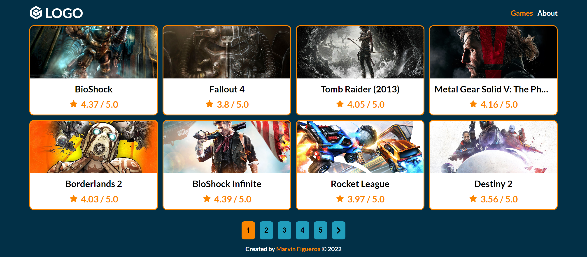
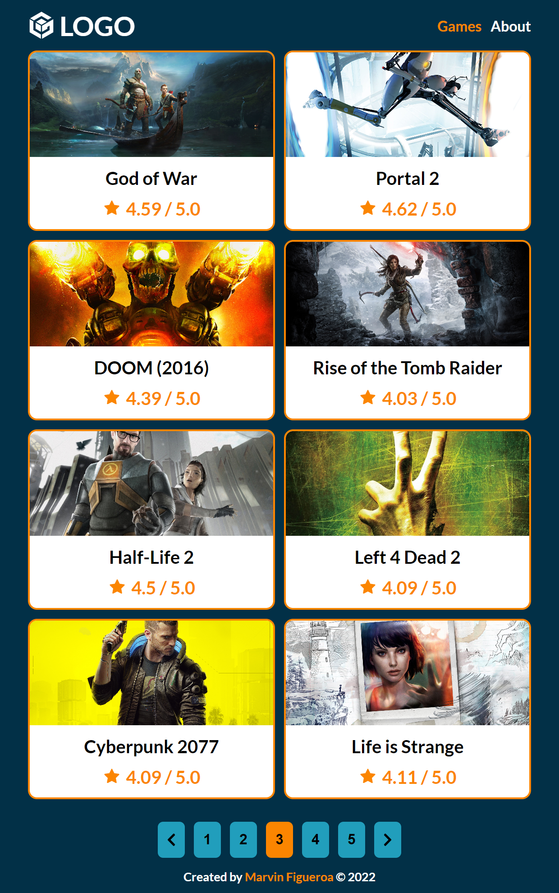
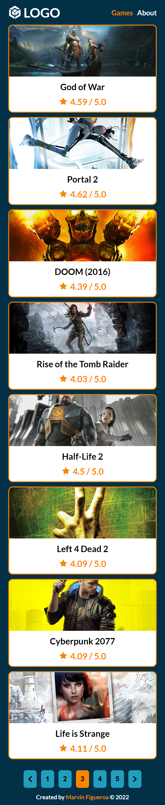

# Homework Week 4

## Description

The homework consists of creating a website for a video game store using ReactJS and deploying json-server to the glitch platform to use it as a backend to interact with the game's data stored in the db.json file. The website must allow the user to view the list of games using pagination, also view the details of a particular game and its comments if there are any.

## Live Site

[Vercel Deployment](https://homework-week-4.vercel.app/)

## Built With

- Semantic HTML5 markup
- CSS Flexbox
- CSS Grid
- Desktop-First approach
- Sass / Scss
- JavaScript
- Fetch API (GET)
- json-server deployed to glitch as a backend
- React JS Basics
- react-icons package
- react-spinners package

## Visuals

**Screenshot Desktop**

**Screenshot Tablet**

**Screenshot Phone**

